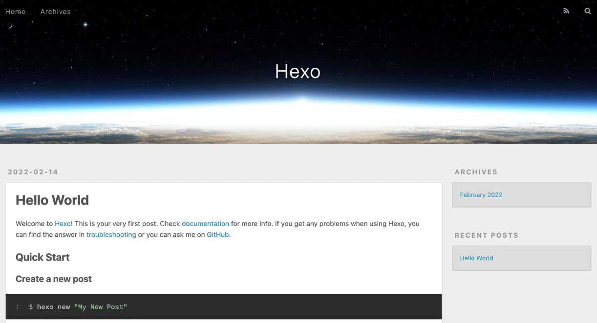

使用 **Hexo** + **Github Page** + **Github Actions** 从零到一带你撸个博客。

<!-- more -->

## 环境安装

### 安装`Git`

[官网](https://git-scm.com/) 根据你的系统选择相应的安装文件，安装过程就不说了。

### 安装`NodeJS`

[官网](https://nodejs.org/en/) 下载一个LTS版本，根据你的系统选择相应的安装文件，安装过程就不说了。

### 安装`Hexo`

    npm install -g hexo

## 注册`Github`账号(熟悉Github的同学请直接跳过)

### 注册Github账号

[传送门直达](https://github.com/signup)

### 创建`SSH Key`(已创建请直接跳过)

中间会要求你输入密码，直接回车表示没有密码

```shell
ssh-keygen
```

输入下面的命令

```shell
cat ~/.ssh/id_rsa.pub
```

复制命令输出的内容

为了不用每次输入密码，配置`Github`的`SSH`


选择 `SSH and GPG keys`,点击 `new SSH key`


在红框内`粘贴`之前复制的内容，点击`Add SSH key`


## 运行你的`Hexo`博客

### 先让博客运行

创建目录(以Mac为例)

```shell
mkdir ~/blog && cd ~/blog
```

初始化**Hexo**博客

```shell
hexo init .
```

启动**Hexo**预览

```shell
hexo s
```

这时候就可以在 [http://localohost:4000](http://localohost:4000) 打开你的博客了



### 写下你的第一篇日志

另起一个终端窗口
```shell
hexo new post 我的第一篇日志
```

刷新页面，你的首页就会出现你的第一篇日志


### 修改第一篇日志内容

打开你的博客目录，在`/source/_posts/`目录下，你可以看到`我的第一篇日志.md`。编辑他，刷新你的网页，你就可以在网页上看到最新的内容。

日志编写格式是`Markdown`，具体语法我给给传送门，不做赘述

> [基础用法](https://www.markdownguide.org/basic-syntax/)

> [进阶用法](https://www.markdownguide.org/extended-syntax/)

## 发布博客

### 创建一个`Repository`(已创建请直接跳过)

点击右上角的`+`号


输入`Repository name` 然后点击`Create Repository`


### 把博客源文件上传到`Github`

#### 设置远程地址

这些操作都得在你的博客目录下完成，本案例中的目录是`~/blog`

```shell
git init
```

还记得刚刚在`Github`上创建的`Repository`吗？


`HTTPS` OR `SSH` 选择 `SSH`，然后复制红色框框里面的内容

```shell
git remote add origin 刚刚复制的Repository地址
```

#### 添加缓存文件
```shell
git add .
```

#### 提交源代码
```shell
git commit -m "init"
```

#### 上传博客源码

```shell
git push --set-upstream origin master
```


### 修改发布方式

#### 修改配置文件
找到博客目录下的 `_config.yml` 文件，找到最下方的 `deploy`，修改为

```yaml
deploy:
  type: git
  repo: 你的Repository地址，上面有提到过
  branch: gh-pages
```

#### 安装插件
先安装`Git`发布插件
```shell
npm install hexo-deployer-git --save
```

#### 发布博客
```shell
hexo d
```

等待执行完毕，发布成功

#### 配置`Github Page`

1. 可以在红色小框框内看到你的可访问网址。
2. `Source` 选择 `Branch:gh-pages`


## 自动化发布博客

发布基本上可以说做完了，接下来要简化我们的工作流程。

我们不想每次都在客户端执行 `hexo d` 去发布最新的博客。能不能有一个`CI工具`帮帮我们呢？

答案是：`可以的`

### Github Actions

**注意哦，这个是比较隐私的部分，需要保证自己的私钥安全**

#### 复制你的SSH私钥

```shell
cat ~/.ssh/id_rsa
```
复制命令输出的内容

#### 配置`Secrets`

点击`Settings` > `Secrets` > `Actions` > `New repository secret`


注意`Name`需要填写`DEPLOY_KEY`，`Value`就是刚刚复制的`cat ~/.ssh/id_rsa`输出的内容


#### 添加自动发布文件

创建文件夹`.github/workflows/`
```shell
mkdir -p .github/workflows
```

创建文件`deploy.yml`,把一下内容粘贴进去
```yaml
name: Deploy

on: [push]

jobs:
  build:
    runs-on: ubuntu-latest
    name: Deploy hexo blog
    steps:
      - name: Checkout
        uses: actions/checkout@master
        with:
          submodules: true

      - name: Cache node modules
        uses: actions/cache@v1
        id: cache
        with:
          path: node_modules
          key: ${{ runner.os }}-node-${{ hashFiles('**/package-lock.json') }}
          restore-keys: |
            ${{ runner.os }}-node-

      - name: Install Dependencies
        if: steps.cache.outputs.cache-hit != 'true'
        run: npm ci

      - name: Deploy
        id: deploy
        uses: sma11black/hexo-action@v1.0.3
        with:
          deploy_key: ${{ secrets.DEPLOY_KEY }}
          user_name: e-sen  # (or delete this input setting to use bot account)
          user_email: i@iamee.me  # (or delete this input setting to use bot account)
          commit_msg: ${{ github.event.head_commit.message }}  # (or delete this input setting to use hexo default settings)
          # Use the output from the `deploy` step(use for test action)

      - name: Get the output
        run: |
          echo "${{ steps.deploy.outputs.notify }}"
```


## 大功告成！

以后你就可以直接在你的`Repository`里面修改你的文件。

比如说新建一篇日志，就直接在`sources/_posts`下面 `Add file` > `Create new file`,然后按照**Hexo**需要的格式(注意，要使用.md后缀，用`Markdown`的语法来书写你的日志)，书写你的日志。

保存之后，大概需要几分钟，你的博客就会出现新的内容了（当然，要记得刷新）。