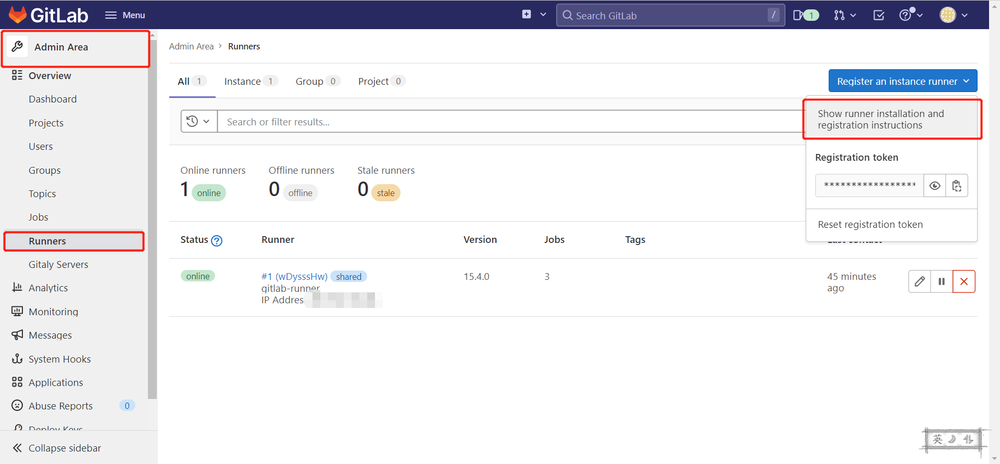
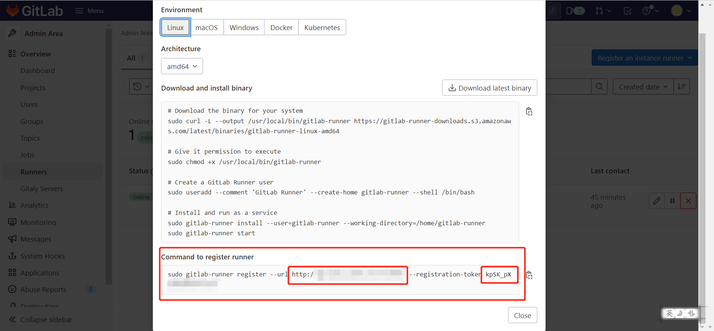
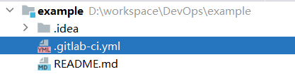
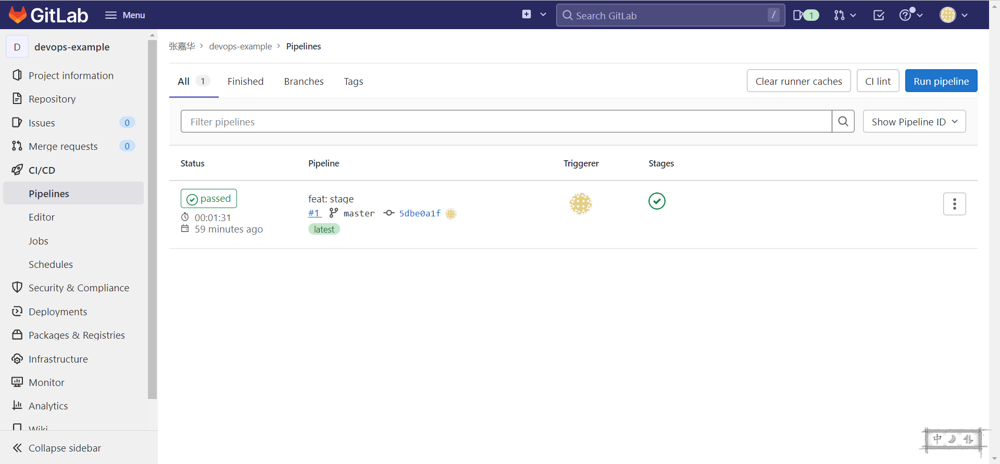
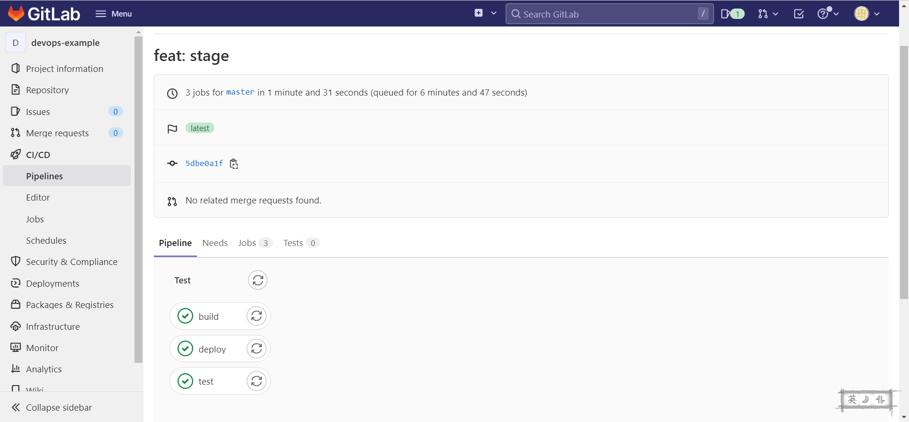

自建 **Gitlab** 、 **Gitlab Runner** 开始玩 DevOps

<!-- more -->

我是一个喜欢偷懒的人，重复的劳动，总喜欢找一些工具帮自己干。

## 搭建 **Gitlab**

在这里，不教。。。默认你已经搭建好自己的**Gitlab**了。

## 注册 **Gitlab-Runner**

这里主要是使用**Docker**的方式，环境嘛，主要是**Linux**系统，Windows系统可能不适用。毕竟懒~~

不想看[官方文档](https://docs.gitlab.com/runner/register/)，就按我废话连篇。

```shell
docker run --rm -it -v /srv/gitlab-runner/config:/etc/gitlab-runner gitlab/gitlab-runner register
```

敲完，等他拉镜像，拉完镜像你可以看到下面这句话。

```shell
Enter the GitLab instance URL (for example, https://gitlab.com/):
```

在这里，你可以拿到你所需的资料，




注册好你的**Gitlab Runner**，这时候你就可以在你的后台看到已经有一个注册好的**Gitlab-Runner**了。

    其实这里，就是为了生成一个 config.toml 文件

这里的神秘字符串，不是上面截图的那个马赛克 Token 。配置文件里的神秘字符串必须是通过注册得到的。

```toml
concurrent = 1
check_interval = 0

[session_server]
  session_timeout = 1800

[[runners]]
  name = "gitlab-runner"
  url = "神秘Url"
  id = 1
  token = "神秘字符串"
  token_obtained_at = 2022-09-26T04:40:29Z
  token_expires_at = 0001-01-01T00:00:00Z
  executor = "docker"
  [runners.custom_build_dir]
  [runners.cache]
    [runners.cache.s3]
    [runners.cache.gcs]
    [runners.cache.azure]
  [runners.docker]
    tls_verify = false
    image = "ubuntu:18.04"
    privileged = false
    disable_entrypoint_overwrite = false
    oom_kill_disable = false
    disable_cache = true
    volumes = ["/cache"]
    shm_size = 0
```

注册好了，现在也还不行。

## 启动你的**Gitlab-Runner**

就是这么枯燥，照着敲就可以了。。

```shell
docker run -d --name gitlab-runner --restart always \
    -v /var/run/docker.sock:/var/run/docker.sock \
    -v gitlab-runner-config:/etc/gitlab-runner \
    gitlab/gitlab-runner:latest
```

OK，在后台就能看到一个在线的 **Gitlab Runner** 了。

## 实验一下吧

创建一个空白项目，拉下来。

创建一个 `.gitlab-ci.yml` 文件，这个是关键。



直接抄吧，看看效果

```yaml
default:
  image: ubuntu:18.04

stages:
  - build
  - test
  - deploy


build:
  script: echo 'build'
  only:
    refs:
      - tags

test:
  script: echo 'test'

deploy:
  script: echo 'deploy'

```

OK，等他一会儿。第一次要拉镜像，会比较慢。后面就快了。



再贴点儿图。



这是最基本的应用，接下来是进阶玩法。分支，TAG，自动打包逻辑。需要通过编写`.gitlab-ci.yml`来控制。

暂时先写这么多，下次继续。