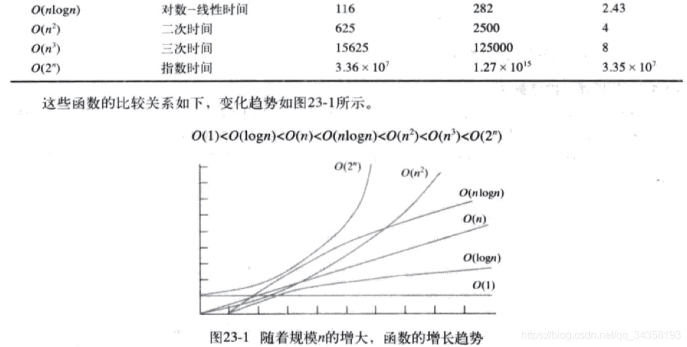

天道有轮回，苍天绕过谁~

    吐槽一下，MD！曾经偷过的懒，终究都要偿还

这次来偿还 `算法`&`优化` 的债了

## 时间复杂度

先说结论`咳咳，抛开数据量来说复杂度也是扯淡`

    O(1) < O(logn) < O(n) < O(nlogn) < O(n²) < O(2^n)

|    类型    |                            意义                            |                         举例                         |  
|:--------:|:--------------------------------------------------------:|:--------------------------------------------------:|
|   O(1)   |    最低复杂度，常量值，也是耗时，耗空间与输入数据大小无关，无论输入数据增大多少倍，耗时/耗空间都不变     | 哈希算法就是典型的O(1)时间复杂度，无论数据规模多大，都可以在一次计算后找到目标（不考虑冲突的话） |
|   0(n)   |                     数据量增大几倍，耗时也增大几倍                      |                        遍历算法                        |
| O(logn)  | 当数据增大n倍时，耗时增大logn倍(这里的log是以2为底的，比如说，当数据增大256倍时，耗时只增大8倍)  | 二分查找就是O(logn)的算法，每找一次排除一半的可能，256个数据中查找只要找8次就可以找到目标 |
|  O(n²)   |                     对n个数排序，需要扫描n*n次                      |                        冒泡排序                        |
| O(nlogn) | 就是n乘以logn，当数据增大256倍时，耗时增大256*8=2048倍。这个复杂度高于O(n)低于O(n²)。 |               归并排序就是O(nlogn)的时间复杂度。                |

## 常见排序的时间复杂度

    稳定性表示，排序后两个相等的键值的顺序和排序之前的顺序相同

| 排序算法 |  平均复杂度   |   最好情况    |   最坏情况    |  空间复杂度  |   排序方式    | 稳定性 |
|:----:|:--------:|:---------:|:---------:|:-------:|:---------:|:---:|
| 冒泡排序 |  O(n²)   |   O(n)    |   O(n²)   |  O(1)   | In-place  | 稳定  |
| 选择排序 |  O(n²)   |   O(n²)   |   O(n²)   |  O(1)   | In-place  | 不稳定 |
| 插入排序 |  O(n²)   |   O(n)    |   O(n²)   |  O(1)   | In-place  | 稳定  |
| 希尔排序 | O(nlogn) | O(nlog²n) | O(nlog²n) |  O(1)   | In-place  | 不稳定 |
| 归并排序 | O(nlogn) | O(nlogn)  | O(nlogn)  |  O(n)   | Out-place | 稳定  | 
| 快速排序 | O(nlogn) | O(nlogn)  |   O(n²)   | O(logn) | In-place  | 不稳定 |
| 堆排序  | O(nlogn) | O(nlogn)  | O(nlogn)  |  O(1)   | In-place  | 不稳定 |
| 计数排序 |  O(n+k)  |  O(n+k)   |  O(n+k)   |  O(k)   | Out-place | 稳定  |
| 桶排序  |  O(n+k)  |  O(n+k)   |   O(n²)   | O(n+k)  | Out-place | 稳定  |
| 基数排序 |  O(n*k)  |  O(n*k)   |  O(n*k)   | O(n+k)  | Out-place | 稳定  |
